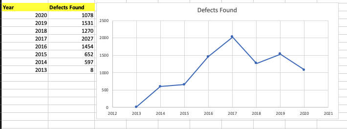

# HackerOne Defects
## Public Defects since 2013

Statistics of HackerOne BugBounty:
This was last updated as of the **13th July 2020**

## Import the SQL file
[hacktivity_BugsHackerOne.sql](sqlDump/hacktivity_BugsHackerOne.sql)

```mysql -u username -p database_name < hacktivity_BugsHackerOne.sql```


